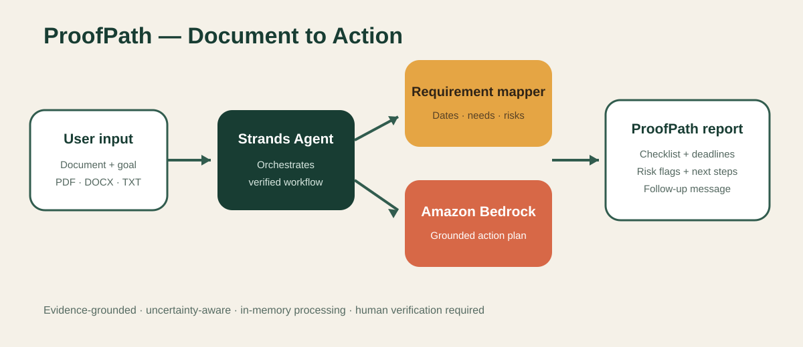

# ProofPath

ProofPath is an evidence-grounded bureaucracy and application navigator built for the **Agents for Humans Hackathon**. It turns confusing official documents into plain-language explanations, deadlines, requirements, risk flags, missing questions, and step-by-step completion plans.



## The problem

People routinely receive dense university, benefits, insurance, housing, government, and administrative documents. Understanding them is only the first step—they must still identify requirements, sequence tasks, meet deadlines, and retain proof. This burden is especially difficult for non-native speakers and anyone unfamiliar with the process.

## What makes it agentic

A Strands Agent calls the deterministic `requirement_mapper`, builds an **Evidence Graph**, distinguishes explicit facts from suggestions, identifies missing information, and produces an actionable completion path. Every requirement node keeps its exact source excerpt, confidence label, verification state, and fingerprint. Amazon Bedrock personalizes the explanation—including Roman Urdu when requested. A local fallback keeps the demo reliable.

## Features

- PDF, DOCX, TXT, or pasted document input
- Custom Strands `requirement_mapper` tool
- Date, requirement, and consequence extraction
- Context-aware checklist and follow-up message
- Amazon Bedrock integration plus local fallback
- Downloadable Markdown report
- Anti-injection and anti-fabrication instructions
- Evidence-linked requirement graph with provenance hashes
- Human-in-the-loop verification checkpoint
- MCP server so other AI clients can reuse ProofPath as a tool

## Run

```powershell
python -m venv .venv
.venv\Scripts\Activate.ps1
pip install -r requirements.txt
$env:AWS_REGION="us-west-2"
$env:BEDROCK_MODEL_ID="global.anthropic.claude-sonnet-4-6"
streamlit run app.py
```

## Workflow

1. User adds a document and their situation.
2. The parser extracts text in memory.
3. Strands calls `requirement_mapper`.
4. The tool extracts explicit facts and risks.
5. Bedrock creates a grounded action path.
6. The user verifies and downloads the checklist.

## Architecture pattern

The code follows a lightweight Model–Controller–View separation:

- **Model:** `career_agent/analysis.py`, `evidence_graph.py`, and `parser.py`
- **Controller:** `career_agent/workflow.py` and its Strands tool orchestration
- **View:** `app.py`, a Streamlit interface

MVC is the maintainability pattern; the AI concepts are tool use, evidence provenance, structured dependency graphs, bounded generation, graceful model fallback, and human-in-the-loop verification.

## MCP integration

ProofPath exposes its evidence mapper as a local Model Context Protocol server:

```powershell
python mcp_server.py
```

MCP clients can call `map_document_requirements` to receive nodes, edges, unknowns, dates, risks, a document fingerprint, and a mandatory human-verification flag.

## Responsible use

ProofPath provides organizational assistance—not legal, medical, immigration, or financial advice. It never determines eligibility or invents missing facts. Confirm critical information with the issuer or a qualified professional.

## Test

```powershell
python -m pytest -q
```

## License

MIT
